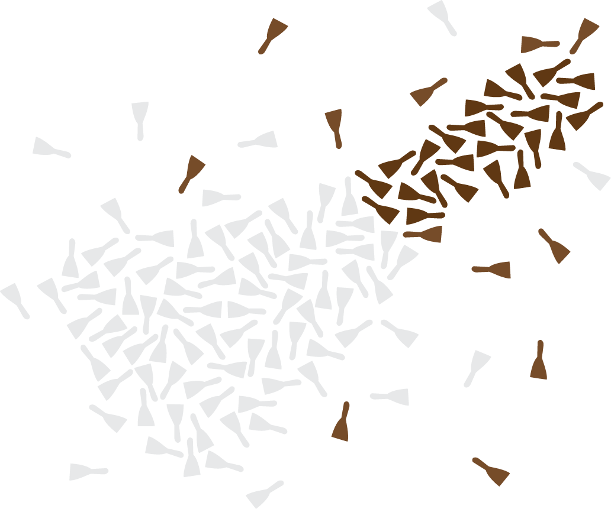

Scrapy Cluster |version| Documentation
==========================================

This documentation provides everything you need to know about the `Scrapy <http://scrapy.org/>`_ based distributed crawling project, `Scrapy Cluster <https://github.com/istresearch/scrapy-cluster>`_.

.. toctree::
    :hidden:
    :maxdepth: 2

    topics/introduction/index
    topics/kafka-monitor/index
    topics/crawler/index
    topics/redis-monitor/index
    topics/rest/index
    topics/admin-ui/index
    topics/utils/index
    topics/advanced/index
    topics/faq
    topics/debugging
    topics/contributing
    topics/changelog
    topics/license

Introduction
---------------

:doc:`topics/introduction/overview`
    Learn about the Scrapy Cluster Architecture.

:doc:`topics/introduction/quickstart`
    A Quick Start guide to those who want to jump right in.

Architectural Components
------------------------

Kafka Monitor
^^^^^^^^^^^^^

:doc:`topics/kafka-monitor/design`
    Learn about the design considerations for the Kafka Monitor

:doc:`topics/kafka-monitor/quickstart`
    How to use and run the Kafka Monitor

:doc:`topics/kafka-monitor/api`
    The default Kafka API the comes with Scrapy Cluster

:doc:`topics/kafka-monitor/plugins`
    Gives an overview of the different plugin components within the Kafka Monitor, and how to make your own.

:doc:`topics/kafka-monitor/settings`
    Explains all of the settings used by the Kafka Monitor

Crawler
^^^^^^^

:doc:`topics/crawler/design`
    Learn about the design considerations for the Scrapy Cluster Crawler

:doc:`topics/crawler/quickstart`
    How to use and run the distributed crawlers

:doc:`topics/crawler/controlling`
    Learning how to control your Scrapy Cluster will enable you to get the most out of it

:doc:`topics/crawler/extension`
    How to use both Scrapy and Scrapy Cluster to enhance your crawling capabilites

:doc:`topics/crawler/settings`
    Explains all of the settings used by the Crawler

Redis Monitor
^^^^^^^^^^^^^

:doc:`topics/redis-monitor/design`
    Learn about the design considerations for the Redis Monitor

:doc:`topics/redis-monitor/quickstart`
    How to use and run the Redis Monitor

:doc:`topics/redis-monitor/plugins`
    Gives an overview of the different plugin components within the Redis Monitor, and how to make your own.

:doc:`topics/redis-monitor/settings`
    Explains all of the settings used by the Redis Monitor

Rest
^^^^

:doc:`topics/rest/design`
    Learn about the design considerations for the Rest service

:doc:`topics/rest/quickstart`
    How to use and run the Rest service

:doc:`topics/rest/api`
    The API the comes with the endpoint

:doc:`topics/rest/settings`
    Explains all of the settings used by the Rest component

Admin UI
^^^^^^^^

:doc:`topics/admin-ui/design`
    Learn about the design considerations for the Admin-UI service

:doc:`topics/admin-ui/quickstart`
    How to use and run the Admin-UI service

:doc:`topics/admin-ui/settings`
    Explains all of the settings used by the Admin-UI component

Utilities
^^^^^^^^^

:doc:`topics/utils/argparsehelper`
    Simple module to assist in argument parsing with subparsers.

:doc:`topics/utils/logfactory`
    Module for logging multithreaded or concurrent processes to files, stdout, and/or json.

:doc:`topics/utils/methodtimer`
    A method decorator to timeout function calls.

:doc:`topics/utils/redisqueue`
    A module for creating easy redis based FIFO, Stack, and Priority Queues.

:doc:`topics/utils/redisthrottledqueue`
    A wrapper around the ``redis_queue`` module to enable distributed throttled pops from the queue.

:doc:`topics/utils/settingswrapper`
    Easy to use module to load both default and local settings for your python application and provides a dictionary object in return.

:doc:`topics/utils/statscollector`
    Module for statistics based collection in Redis, including counters, rolling time windows, and hyperloglog counters.

:doc:`topics/utils/zookeeperwatcher`
    Module for watching a zookeeper file and handles zookeeper session connection troubles and re-establishment of watches.

Advanced Topics
---------------

:doc:`topics/advanced/upgrade`
    How to update an older version of Scrapy Cluster to the latest

:doc:`topics/advanced/integration`
    Visualizing your cluster with the ELK stack gives you new insight into your cluster

:doc:`topics/advanced/docker`
    Use docker to provision and scale your Scrapy Cluster

:doc:`topics/advanced/crawlingresponsibly`
    Responsible Crawling with Scrapy Cluster

:doc:`topics/advanced/productionsetup`
    Thoughts on Production Scale Deployments

:doc:`topics/advanced/dnscache`
    DNS Caching is bad for long lived spiders

:doc:`topics/advanced/responsetime`
    How the production setup influences cluster response times

:doc:`topics/advanced/kafkatopics`
    The Kafka Topics generated when typically running the cluster

:doc:`topics/advanced/rediskeys`
    The keys generated when running a Scrapy Cluster in production

:doc:`topics/advanced/comparison`
    A comparison with other Scrapy projects that are distributed in nature

Miscellaneous
-------------

:doc:`topics/faq`
    Scrapy Cluster FAQ

:doc:`topics/debugging`
    Debugging distributed applications is hard, learn how easy it is to debug Scrapy Cluster.

:doc:`topics/contributing`
    Learn how to contribute to Scrapy Cluster

:doc:`topics/changelog`
    View the changes between versions of Scrapy Cluster.

:doc:`topics/license`
    Scrapy Cluster is licensed under the MIT License.
