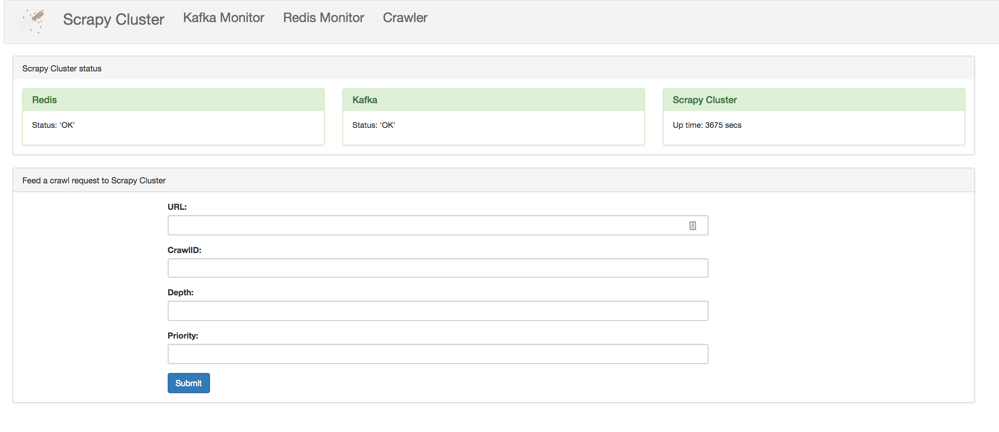

Design
======

The Admin UI is designed to act as a simple interface from which a user can manage Scrapy Cluster. It is designed to make tasks such as stats requests and submit crawl job requests easier and quicker to perform.

The Admin UI service is one of the newer components to Scrapy Cluster, and provides an intuitive interface for a user to interact with Scrapy Cluster. In time additional functionality will be added to the Admin UI service to make it a one stop shop for managing Scrapy Cluster deployments.

The Admin UI using the Plotly JS and Python libraries to generate visulaisations for display stats.
