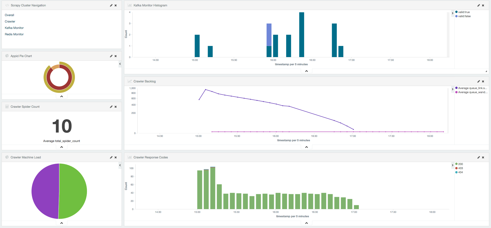
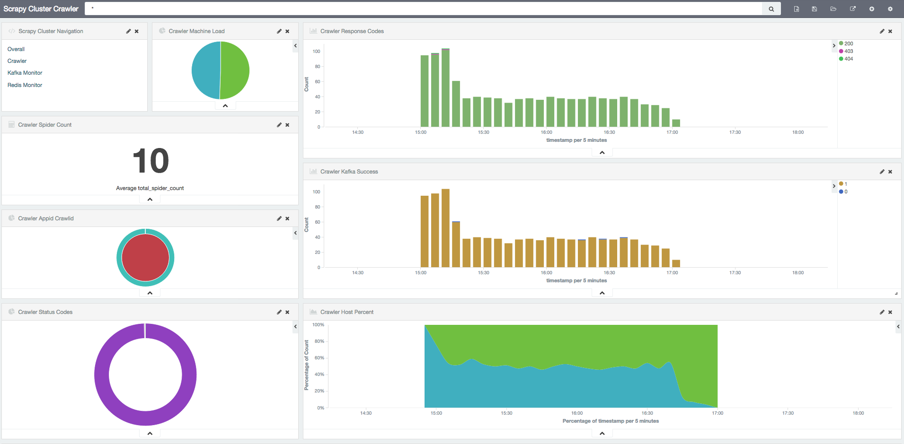
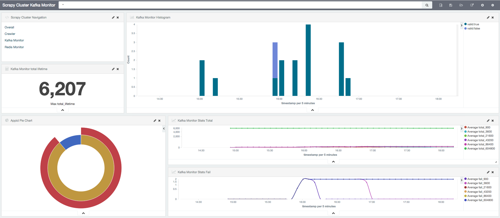
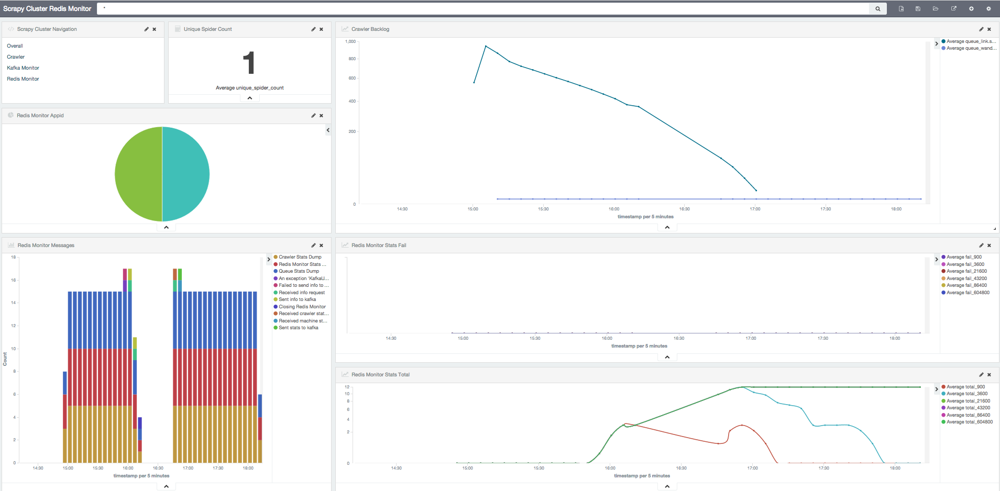
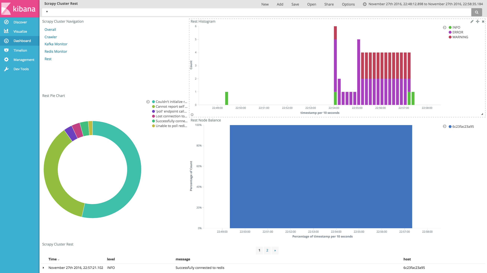

Integration with ELK
====================

Scrapy Cluster's :ref:`Log Factory<log_factory>` has the ability to change the log output from human readable to JSON, which integrates very nicely with tools like `Elasticsearch <https://www.elastic.co/products/elasticsearch>`_, `Logstash <https://www.elastic.co/products/logstash>`_, and `Kibana <https://www.elastic.co/products/kibana>`_. This page will guide you on how to set up basic monitoring and visualizations of your Scrapy Cluster through the ELK stack.

.. warning:: This guide does not cover how to set up or maintain any of the technologies used within. You should already be familiar with the ELK stack and have a working Scrapy Cluster before you begin.

Scrapy Cluster Setup
--------------------

You should alter a couple of settings used within each of the main components of Scrapy Cluster. Change the ``localsettings.py`` files to be updated with the following.

**Kafka Monitor**

* ``LOG_STDOUT = False`` - Forces the Kafka Monitor logs to be written to a file on the machine

* ``LOG_JSON = True`` - Flips logging output from human readable to JSON.

* ``LOG_DIR = '/var/log/scrapy-cluster'`` - Logs the file into a particular directory on your machines

**Redis Monitor**

* ``LOG_STDOUT = False`` - Forces the Redis Monitor logs to be written to a file on the machine

* ``LOG_JSON = True`` - Flips logging output from human readable to JSON.

* ``LOG_DIR = '/var/log/scrapy-cluster'`` - Logs the file into a particular directory on your machines

**Crawler**

* ``SC_LOG_STDOUT = False`` - Forces the Crawler logs to be written to a file on the machine

* ``SC_LOG_JSON = True`` - Flips logging output from human readable to JSON.

* ``SC_LOG_DIR = '/var/log/scrapy-cluster'`` - Logs the file into a particular directory on your machines

**Rest**

* ``LOG_STDOUT = False`` - Forces the Rest service logs to be written to a file on the machine

* ``LOG_JSON = True`` - Flips logging output from human readable to JSON.

* ``LOG_DIR = '/var/log/scrapy-cluster'`` - Logs the file into a particular directory on your machines

.. note:: Depending on your machine's ``/var/log`` folder permissions, you may need to create the ``scrapy-cluster`` directory manually and ensure your Scrapy Cluster processes have permission to write to the directory.

You should now be able to ``tail -f`` any of your logs and see the JSON objects flowing by.

Logstash
--------

This setup assumes you have Logstash or `FileBeat <https://www.elastic.co/products/beats>`_ set up, in order to forward your logs to Elasticsearch. For this, we will assume Logstash is installed on every machine, but the set up should be similar enough to work with File Beat.

We will use Logstash to automatically store and manage Scrapy Cluster's logs via a `Mapping Template <https://www.elastic.co/guide/en/elasticsearch/reference/current/indices-templates.html>`_. This allows us to automatically format our logs within Elasticsearch so Kibana can display them properly. This is the mapping template we will use:

::

  {
    "template" : "logs-*",
    "order" : 0,
    "settings" : {
      "index.refresh_interval" : "5s"
    },
    "mappings" : {
      "_default_" : {
        "dynamic_templates" : [ {
          "message_field" : {
            "mapping" : {
              "omit_norms" : true,
              "type" : "keyword"
            },
            "match_mapping_type" : "keyword",
            "match" : "message"
          }
        }, {
          "keyword_fields" : {
            "mapping" : {
              "omit_norms" : true,
              "type" : "keyword"
            },
            "match_mapping_type" : "keyword",
            "match" : "*"
          }
        } ],
        "properties" : {
          "@version" : {
            "index" : "not_analyzed",
            "type" : "keyword"
          }
        },
        "_all" : {
          "enabled" : true
        }
      }
    },
    "aliases" : { }
  }

Save this file as ``logs-template.json`` in your logstash templates directory, here we will assume it is located at ``/etc/logstash/templates/``.

Now we need to configure Logstash to use the template, and read from our logs. For this we will use a simple file input and elasticsearch output available via Logstash.

::

  input {
    file {
      path => ['/var/log/scrapy-cluster/*.log']
      codec => json
      tags => ['scrapy-cluster']
    }
  }

  output {
    if 'scrapy-cluster' in [tags]{
      elasticsearch {
        hosts => "<your es hosts here>"
        template => "/etc/logstash/templates/logs-template.json"
        template_name => "logs-*"
        template_overwrite => true
        index => "logs-scrapy-cluster"
        document_type => "%{[logger]}"
      }
    }
  }

Save this file as ``scrapy-cluster-logstash.conf``, and put it into the folder where Logstash reads its configuration files. This logstash template says that we are going to read from any file that matches our pattern ``*.log`` within the Scrapy Cluster log folder we defined prior. The output of this operation says to ship that log to our Elasticsearch hosts, using the template we created one step above. This will write our logs to the Elasticsearch index ``logs-scrapy-cluster``, with the document `type <https://www.elastic.co/guide/en/elasticsearch/guide/current/mapping.html>`_ defined as the logger name.

What we end up with is one single index where our logs are stored, and each type of log (Kafka Monitor, Redis Monitor, and Crawler) split into a different series of documents.

You will need to restart your Logstash instance to read the new settings, but once running you should end up with any new logs being written both to disk and to your Elasticsearch cluster.

``http://<your es host>:9200/logs-scrapy-cluster/_count?pretty``

::

    {
      "count": 19922,
      "_shards": {
        "total": 1,
        "successful": 1,
        "failed": 0
      }
    }

Here, we have done a bit of crawling already and have around 20,000 log records in our index.

At this point you should now have your logs indexed in Elasticsearch, and we can use Kibana to visualize them.

.. _elk_kibana:

Kibana
------

In your Kibana instance, you now need to configure a new index pattern. If you would like to be exact, use ``logs-scrapy-cluster``, or if you plan on using the provided templates in other projects you can use ``logs-*``. Configure the time value to be ``timestamp``, **NOT** ``@timestamp``. The latter is an auto-generated timestamp by logstash, and does not reflect the real time the log was written by the process.

From here, you can play around with the different searching and visualization functions provided by Kibana.

If you would like to use some preconfigured searches and visualizations, go to **Settings** and (at time of writing) click **Saved Objects**, then **Import**. We are going to import a sample set of visualizations and searches from the Scrapy Cluster project under the folder ``elk``. Select the ``export.json`` file to import everything in.

.. note:: It is important you actually use your cluster before you try to upload the preconfigured visualizations. This ensures the defined mappings within Elasticsearch are present for the widgets. You can check this by looking at the number of fields in your index defined above - if is has over **170** different fields you should be ok to import, otherwise refresh it, use the cluster more, or exercise a different component.

You should now have a number of different Visualizations, Dashboards, and Searches so you can better understand how your cluster is operating at scale.

.. note:: The graphs below only show a sample series of three or four crawl requests over a span of four hours. A typical cluster will have hundreds or thousands of requests per minute!

Overall
^^^^^^^

This is a high level overview dashboard of all three components of your Scrapy Cluster. This is the typical view to go to when you would like to know what is going on across all of your different components.

Crawler
^^^^^^^

The Crawler dashboard view shows you a much more in depth view of your current Scrapy Crawlers. Here you see breakdowns of response codes, machine load balances, and successful outbound Kafka messages.

Kafka Monitor
^^^^^^^^^^^^^

This view gives you better insight into the Kafka Monitor and the APIs in which it is testing against. It shows a breakdown of application requests and overall usage of the Kafka Monitor.

Redis Monitor
^^^^^^^^^^^^^

The Redis Monitor breakdown shows you the backlog of your current spiders, and the different requests the Redis Monitor has had to process from your cluster.

Rest
^^^^

The Rest breakdown gives you a view of the endpoints and logs being generated by the Rest components in your cluster. It shows a basic breakdown over time and by log type.

----

Feel free to add to or tinker with the visualizations provided! You should now have a much better understanding about what is going on within your Scrapy Cluster.