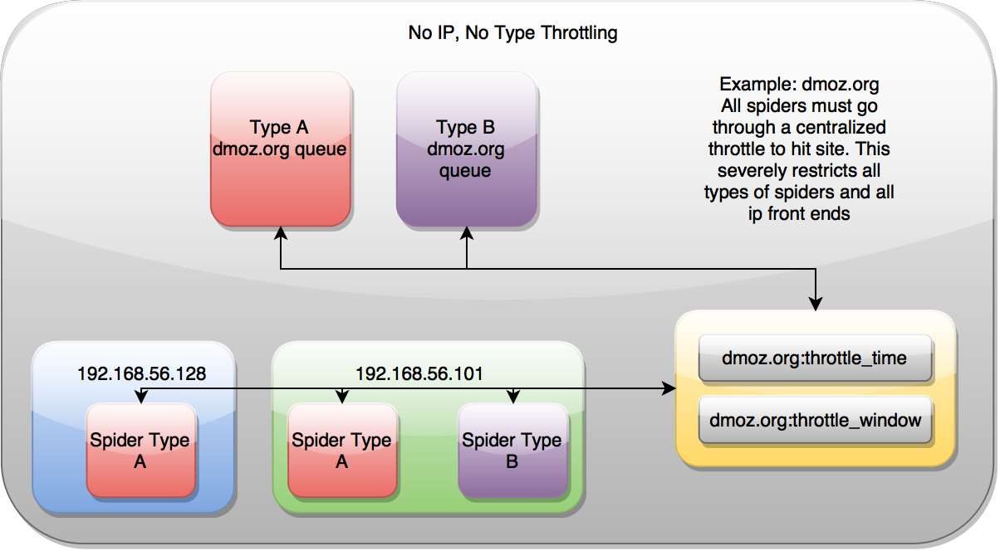
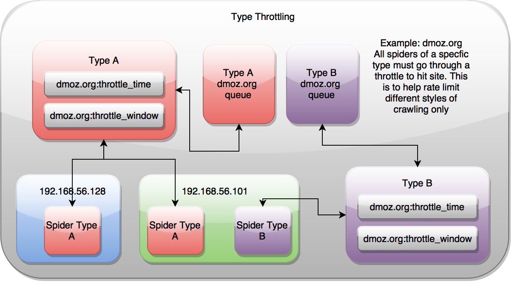
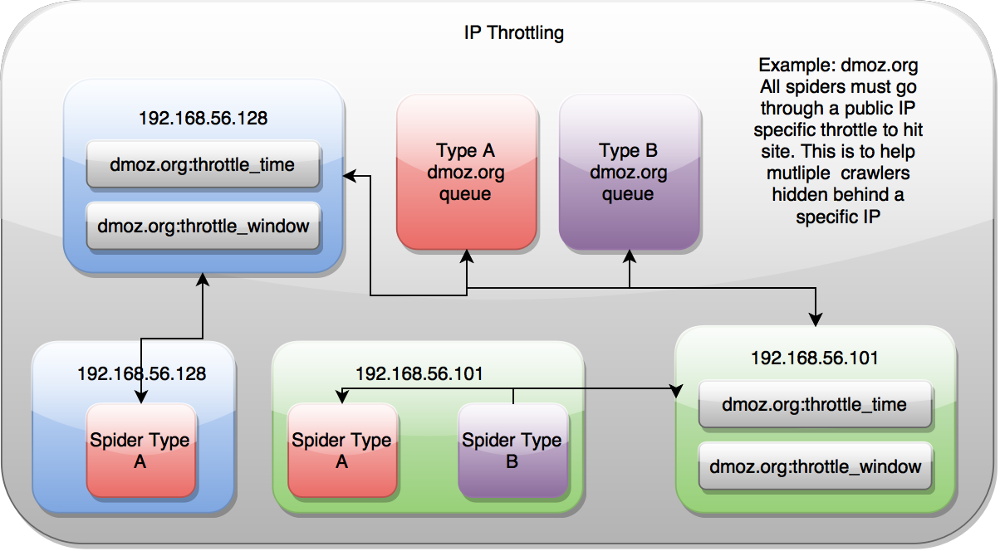
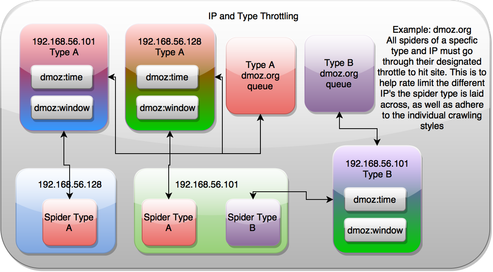

.. _controlling:

Controlling
===========

Scrapy Cluster requires coordination between the different crawling machines in order to ensure maximum content throughput while enabling the cluster manager to control how fast their machines hit different websites.

Scrapy Cluster comes with two major strategies for controlling how fast your pool of spiders hit different domains. This is determined by spider type and/or IP Address, but both act upon the different Domain Queues.

Domain Queues
-------------

Registered domain names are what are commonly used to reference a general website. Some examples are ``google.com``, ``wikipedia.org``, ``amazon.com``, ``scrapy.org``... you get the idea.

Scrapy Cluster allows you to control how fast your cluster hits each of these domains, without interfering with other domains. Each domain is independently coordinated and throttled by the collective Spiders running, allowing both fine tuned and generalized control of how fast your spiders react to new domains and how fast they should crawl them.

.. _general_domain_settings:

General Domain Settings
^^^^^^^^^^^^^^^^^^^^^^^

The following settings will help you control how spiders generally behave when dealing with different domains.

**QUEUE_WINDOW** - A rolling time window of the number of seconds your cluster should remember domain specific hits

**QUEUE_HITS** - Controls how many domain hits are allowed within your ``QUEUE_WINDOW``

Putting these two together, this means that you can control X number of ``QUEUE_HITS`` in a y ``QUEUE_WINDOW``. So **5 hits every 60** seconds, or **10 hits every 30 seconds**. This setting applies cluster-wide, unless overridden via a `Domain Specific Configuration`_.

This is **not** the same as the Scrapy `Auto Throttle <http://doc.scrapy.org/en/latest/topics/autothrottle.html>`_! Scrapy's Auto Throttle works great when running a single Scrapy Spider process, but falls short when coordinating concurrent processes across different machines. Scrapy Cluster's throttling mechanism allows for spiders to coordinate crawls spread across machines.

.. warning:: Scrapy Cluster by default comes with a `very modest` 10 hits per 60 seconds, for any domain it sees. This may seem very slow, but when scaled horizontally across many IP addresses allows you to crawl at a large scale with minimal fear of any individual IP address being blocked.

**SCHEDULER_QUEUE_REFRESH** - Controls how often your spiders check for new domains (other than the ones they have already seen). This is time intensive and means your spider is not crawling, so a higher but responsive time is recommended here.

**QUEUE_MODERATED** - Determines whether you would like cluster of spiders to hit the domain at even intervals spread throughout the ``QUEUE_WINDOW``, or execute crawls as fast as possible and then pause. If you crawl at 10 hits every 60 seconds, a moderated queue would allow your spiders to crawl at one request every 6 seconds (60 sec / 10 hits = 6 secs between every 1 hit). Turning off this setting would allow your spiders to reach their 6 hit cap as fast as possible within the 60 second window.

**SCHEDULER_QUEUE_TIMEOUT** - Gives you control over how long stagnant domain queues persist within the spider before they are expired. This prevents memory build up where a spider has every domain it has ever seen in memory. Instead, only the domains that have been active within this window will stay around. If a domain expires, it can be easily recreated when a new request generated for it.

.. _domain_specific_configuration:

Domain Specific Configuration
^^^^^^^^^^^^^^^^^^^^^^^^^^^^^

For crawls where you know a specific target site, you can override the general settings above and fine tune how fast your cluster hits a specific site.

To do this, please use the :ref:`Zookeeper API <zookeeper_api>` to add, remove, and update domain specific blacklists or domain specific throttle configuration. Adding a domain blacklist means that **all spiders** will ignore crawl requests for a domain, whereas a domain specific throttle will force **all spiders** to crawl the domain at that rate (a blacklist will override this).

Through using the Zookeeper API you will build up a configuration file containing your blacklist and domain throttles.

**example.yml**

This is an example yaml configuration file for overriding the general settings on a site by site basis. Scrapy Cluster requires the configuration to be like the following:

::

    blacklist:
        - <domain3.com>
    domains:
        <domain1.com>:
            window: <QUEUE_WINDOW>
            hits: <QUEUE_HITS>
        <domain2.org>:
            window: <QUEUE_WINDOW>
            hits: <QUEUE_HITS>
            scale: 0.5

The yaml syntax dictates both a blacklist and a series of domains. The blacklist is a list of domains that all spiders should ignore. Within each domain, there is required at minimum to be both a ``window`` and ``hits`` value. These correspond to the ``QUEUE_HITS`` and ``QUEUE_WINDOW`` above. There is also an optional value called ``scale``, where you can apply a scale value between 0 and 1 to the domain of choice. The combination of the window, hits, and scale values allows you to fine tune your cluster for targeted domains, but to apply the :ref:`general settings <general_domain_settings>` to any other domain.

.. note:: Your crawler cluster does **not** need to be restarted to read their new cluster configuration! The crawlers use the :ref:`Zookeeper Watcher <zookeeper_watcher>` utility class to dynamically receive and update their configuration.

**file_pusher.py**

.. warning:: The ``file_pusher.py`` manual script is deprecated in favor of the :ref:`Zookeeper API <zookeeper_api>`, and the documentation here may be removed in the future

Once you have a desired yaml configuration, the next step is to push it into Zookeeper using the ``file_pusher.py`` script. This is a small script that allows you to deploy crawler configuration to the cluster.

::

    $ python file_pusher.py -f example.yml -z scdev
    updating conf file

Here we pushed our example configuration file to the Zookeeper host located at ``scdev``. That is all you need to do in order to update your crawler configuration! You can also use an external application to update your Zookeeper configuration file, as long as it conforms to the required yaml syntax.

.. _throttle_mechanism:

Throttle Mechanism
------------------

Now that we have determined how fast our cluster hits a particular domain, we  need to determine how that domain throttle is applied to our spiders and our crawling machines. Each of the four different throttle types are outlined below.

No IP Address, No Type
^^^^^^^^^^^^^^^^^^^^^^

No throttle style dictates that the domain coordination is done through a single place. It is indifferent to the spider or the IP addresses of the machines crawling, ensuring they are all rate limited by one mechanism only.

Type
^^^^

Type throttling means that for each domain, spiders of a different type (ie ``A``, ``B``, ``link``, ``foo``) will orchestrate with themselves to control how fast the cluster hits the domain. This disregards the public IP address of the machines that the Scrapy requests are routed through, so spiders on different machines are throttled based on how fast all of the other spiders in the cluster have hit that particular domain.

IP Address
^^^^^^^^^^

IP Address throttling controls the cluster based on the spider's public facing IP Address, but ignores the type of spider it is. This is most useful when you have various spiders running on your machines, but only want to hit a domain a certain rate.

IP Address and Type
^^^^^^^^^^^^^^^^^^^

IP and Type throttling combines both of the above throttle styles, and allows your spiders to control themselves based upon both their public IP address and the Spider type. This is useful when you have multiple spiders on the same machine that are configured to hit different proxies, and would like to control how fast they hit a domain based upon their spider type `and` their public IP address.

Settings
^^^^^^^^

To utilize the different throttle mechanisms you can alter the following settings in your ``localsettings.py`` file. You then need to restart your crawling processes for the new settings to take effect.

**SCHEDULER_TYPE_ENABLED** - Flag to set the **Type** Style throttling

**SCHEDULER_IP_ENABLED** - Flag to set the **IP Address** Style throttling

Combining Domain Queues and Throttling
--------------------------------------

At the core of Scrapy Cluster is a Redis priority queue that holds all of the requests for a particular spider type and domain, like ``link:dmoztools.net:queue``. The configured throttle determines when an individual Scrapy process can receive a new request from the Redis Queues. Only when the throttle says that it is "ok" will the Spider be returned a link to process.

This results in Spiders across the cluster continually polling all available domain queues for new requests, but only receiving requests when the throttle mechanism indicates that the request limit has not gone beyond the max desired configuration. Because the throttle coordination is conducted via Redis, it is not reliant on any one Scrapy process to determine whether the cluster can or can't crawl a particular domain.

If the spider polls a domain and is denied a request, it will cycle through all other known domains until it finds one that it can process. This allows for very high throughput when crawling many domains simultaneously. Domain A may only allow 10 hits per minute, domain B allows for 30 hits per minute, and domain C allows for 60 hits per minute. **In this case, all three domains can be crawled at the same time by the cluster while still respecting the domain specific rate limits.**

By tuning your cluster configuration for your machine setup and desired crawl rate, you can easily scale your Scrapy Cluster to process as much data as your network can handle.

Inter-spider Communication
--------------------------

By default, Scrapy Cluster spiders yield ``Request``'s to their own spider type. This means that **link** spiders will crawl other **link** spider requests, and if you have another spider running those requests will not interfere.

The distributed scheduler that spider's use is actually flexible in that **you can yield ``Requests`` to other spiders within your cluster.** This is possible thanks to the ``spiderid`` that is built into every crawl request that the cluster deals with.

The spider ``name`` at the top of your Spider class dictates the identifier you can use when yielding requests.

::

  class LinkSpider(RedisSpider):
    name = "link"

You can alse see this same name being used in the Redis Queues

::

  <spiderid>:<domain>:queue

Thanks to the scheduler being indifferent as to what requests it is processing, Spider A can yield requests to Spider B, with both of them using different parsing, pipelines, middlewares, and anything else that is customizable for your spider. All you need to do is set the ``spiderid`` meta field within your request.

::

  response.meta['spiderid'] = 'othername'

While this use case does not come up very often, you can imagine a couple scenarios where this might be useful:

* Your cluster is doing a large crawl using the ``link`` spider, but you have special domains where you would like to switch to a different crawling approach. When Spider A (the one doing the large crawl) hits a target website, it yields a request to Spider B which does a more detailed or custom scrape of the site in question.

* You are following web links from your favorite social media website and submitting them to be crawled by your cluster. On occasion, you get a "login" prompt that your spider can't handle. When that login prompt is detected, you yield to a special ``login`` spider in order to handle the extra logic of scraping that particular site.

* You are scraping a shopping site, and already know all of the main pages you would like to grab. All of the links on your shopping site are actually for products, which have a different set of elements that require different middlewares or other logic to be applied. You main site spider then yields requests to the ``product`` spider.

**So how is this different than using the** ``callback`` **parameter within a normal Scrapy Spider?** It's different because these Spiders may be completely different Scrapy projects, with their own settings, middleware, items, item pipelines, downloader middlewares, or anything else you need to enhance your Scrapy spider. Using a callback requires you to either combine your code, add extra logic, or not conduct special processing you would otherwise get from using two different Scrapy spiders to do very different jobs.

The spiders can yield requests to each other, in a chain, or any other manner in order for your cluster to be successful.
