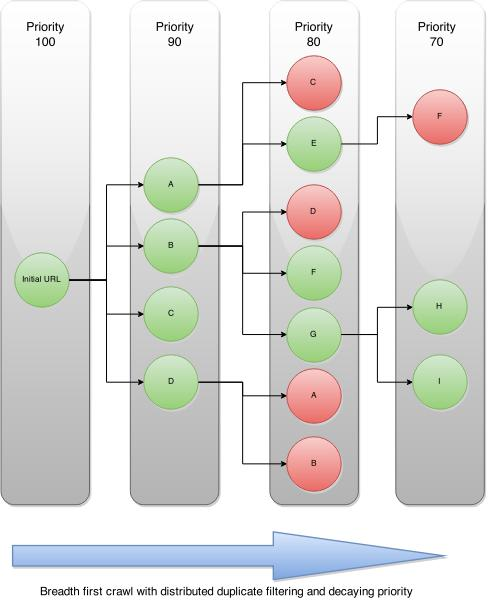
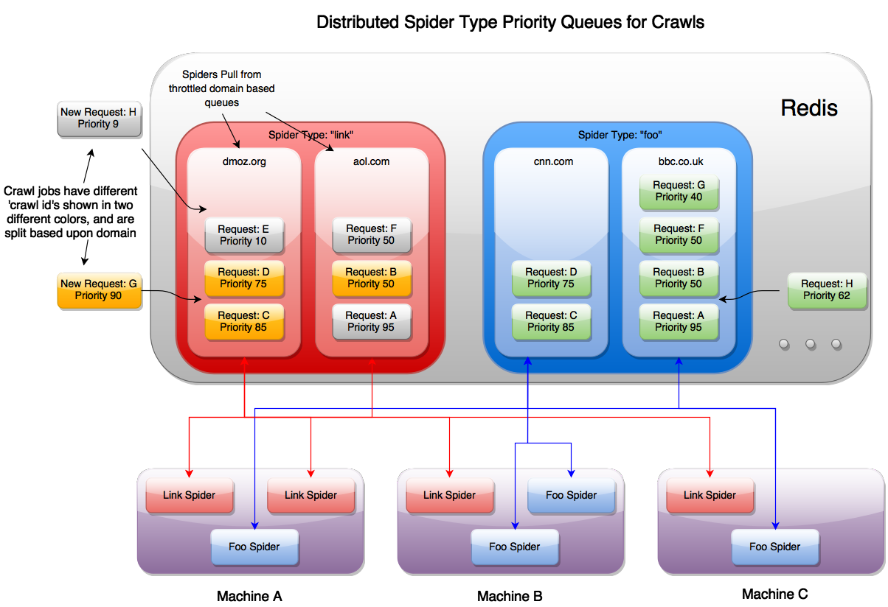

Design
======

The Scrapy Cluster allows for multiple concurrent spiders located on different machines to coordinate their crawling efforts against a submitted crawl job. The crawl queue is managed by Redis, and each spider utilizes a modified Scrapy Scheduler to pull from the redis queue.

After the page has been successfully crawled by the spider, it is yielded to the item pipeline for further processing. If the page was not successfully crawled, the retry middleware included with Scrapy Cluster will resubmit the page back to the queue, to potentially be tried by another spider.

A generic ``link`` spider has been provided as a starting point into cluster based crawling. The link spider simply crawls all links found on the page to the depth specified by the Kafka API request.

Spiders
-------

The core design of the provided link spider is that it tries to be simple in concept and easy to extend into further applications. Scrapy itself is a very powerful and extendable crawling framework, and this crawling project utilizes a unique combination of extensions and modifications to try to meet a new cluster based crawling approach.

Every spider in the cluster is stand alone, meaning that it can function as a complete Scrapy spider in the cluster without any other spiders or processes running on that machine. As long as the spider can connect to Kafka and Redis then you will have a complete working ‘cluster’. The power comes from when you stand multiple crawlers up on one machine, or spread them across different machines with different IP addresses. Now you get the processing power behind a Scrapy spider *and* the benefit of redundancy and parallel computations on your crawl job.

Each crawl job that is submitted to the cluster is given both a priority and is split into it's respective domain based queue. For every subsequent level deep in the crawl that priority decreases by 10, and further requests to crawl pages are put into their own domain queue. This allows you to manage not only the crawl job, but how hard your cluster hits a particular domain of interest.

An example diagram of the breadth first crawling is shown below:

As you can see above, the initial seed url generates 4 new links. Scrapy Cluster uses a Redis priority based queue, so the spiders continue to attempt to pop from the highest priority crawl request for each domain. New links found upon subsequent requests are decreased in priority, and then put back into their respective domain based queues. This allows for the equal priority links to be crawled first.

When a spider encounters a link it has already seen, the duplication filter based on the request’s ``crawlid`` will filter it out. The spiders will continue to traverse the resulting graph generated until they have reached either their maximum link depth or have exhausted all possible urls.

When a crawl is submitted to the cluster, the request it placed into its own specialized queue based on that particular spider type and :ref:`cluster throttle strategy <controlling>`. This allows your cluster to crawl at the desired speed you would like to go to, even though your Scrapy Spiders may be on completely different machines!

The diagram above shows that you can have multiple instances of different spiders running on the same machines, that are all coordinated through a single redis instance. Since every spider knows its own type, it uses the request scheduler to pull new requests from the different domain queues with its name. New requests that come in from Kafka, and requests generated by finding new links while spidering are all sent back into the same priority queue to be crawled.

For example, you can have an ongoing crawl that submits high depth crawl jobs beginning at a priority of 70. These crawls take a lot of resources and will continue to run, but if a user decides to submit a crawl of priority 90, they will immediately get their crawl result returned to them.

Overall, the designs considered for the core scraping component of Scrapy Cluster enable:

- Extendable crawlers thanks to Scrapy

- Distributed crawl efforts across arbitrary machines

- Multiple spider processes capable of independent logic

- Coordinated, lossless frontier expansion of the crawl job

- Distributed throttling and coordination so your scraping cluster does not overload any particular website

- Ability to pass crawl jobs to other spiders within the cluster

Components
----------

This section explains the individual files located within the Scrapy crawler project.

custom_cookies.py
^^^^^^^^^^^^^^^^^

Enables long lived spiders to not cache the cookies received in the Spider cookie jar, yet pass cookies in all Requests. This prevents the spiders from caching response cookies and making subsequent requests with those cookies for a completely different crawl job.

distributed\_scheduler.py
^^^^^^^^^^^^^^^^^^^^^^^^^

A Scrapy Scheduler that tries to find new requests from the Redis queues associated with the spider’s ``name``. Since we are using a link spider, the domain queues it will look for will be called ``link:<domain>:queue``.

The scheduler has all of the same overridden functions you would expect, except for ``has_pending_requests()``. In our tests we found inconsistencies in Scrapy when returning ``True`` when grabbing a new item from within that function or letting the item be returned from ``next_request``. For now we return ``False`` so that the spider goes back to idle, but it is worth investigating more in the future.

items.py
^^^^^^^^

Holds a single basic item yielded by the crawlers to the item pipeline. The RawResponseItem returns other metadata associated with the crawl including:

- response url

- status code

- status message

- headers

- body text

- links found

- passed through attributes

log_retry_middleware.py
^^^^^^^^^^^^^^^^^^^^^^^

Logs and collects statistics about the Spider receiving 504 timeout status codes. This allows you to see in the Scrapy Cluster logs when your Spiders are having trouble connecting to the desired web pages.

meta_passthrough_middleware.py
^^^^^^^^^^^^^^^^^^^^^^^^^^^^^^

Ensures the minimum amount of metadata information from the response is passed through to subsequent requests for the distribtued scheduler to work.

pipelines.py
^^^^^^^^^^^^

The pipelines file is a basic Scrapy Item Pipeline with a three classes contained within. The pipeline classes log to ensure we received the item, it was sent (successfully or not) to Kafka, and then to log that the item's result. The pipeline also checks to make sure that the Kafka topic exists before sending the message to it.

redis\_dupefilter.py
^^^^^^^^^^^^^^^^^^^^

An extremely basic class that serves as a crawl link duplication filter utilizing a Redis Set. This allows two important things:

- Any unique ``crawlid`` will not recrawl a url it has already seen

- New crawl requests with a **different** ``crawlid`` can crawl those same links, without being effected by other crawl duplication filters

This allows for a crawl job over a variety of links to not waste resources by crawling the same things. If you would like to recrawl those same urls, simply submit the same url with a different crawl identifier to the API. If you would like to continue to expand your crawl frontier, submit a crawl with the same identifier.

.. note:: If you continue to submit the same ``crawlid`` and none of the urls have changed, the crawl prematurely stop because it found zero new links to spider.

redis\_retry\_middleware.py
^^^^^^^^^^^^^^^^^^^^^^^^^^^

This class is a Scrapy Downloader Middleware that catches 504 timeout exceptions thrown by the spider. These exceptions are handled differently from other status codes because the spider never even got to the url, so the downloader throws an error.

The url is thrown back into the cluster queue at a lower priority so the cluster can try all other higher priority urls before the one that failed. After a certain amount of retries, the url is given up on and discarded from the queue.

redis\_stats\_middleware.py
^^^^^^^^^^^^^^^^^^^^^^^^^^^

A Spider middleware that allows the spider to record Scrapy Cluster statistics about crawl response codes within Redis. This middleware grabs the response code from the Response object and increments a :ref:`StatsCollector <stats_collector>` counter.

settings.py
^^^^^^^^^^^

Holds both `Scrapy <http://doc.scrapy.org/en/latest/topics/settings.html>`_ and :doc:`Scrapy Cluster <settings>` settings. To override these variables please create a ``localsettings.py`` file, and add your variables in there.

spiders/link\_spider.py
^^^^^^^^^^^^^^^^^^^^^^^

An introduction into generic link crawling, the LinkSpider inherits from the base class RedisSpider to take advantage of a simple html content parse. The spider’s main purpose is to generate two things:

#. Generate more urls to crawl, found by grabbing all the links on the page

#. Generate a ``RawResponseItem`` to be processed by the item pipeline.

These two things enable generic depth based crawling, and the majority of the code used within the class is to generate those two objects. For a single page this spider might yield 100 urls to crawl and 1 html item to be processed by the Kafka pipeline.

.. note:: We do not need to use the duplication filter here, as the scheduler handles that for us. All this spider cares about is generating the two items listed above.

spiders/lxmlhtml.py
^^^^^^^^^^^^^^^^^^^

This is actually a custom version of the Scrapy ``LxmlParserLinkExtractor`` but with one slight alteration. We do not want Scrapy to throw link extraction parsing errors when encountering a site with malformed html or bad encoding, so we changed it to ignore errors instead of complaining. This allows for the continued processing of the scraped page all the way through the pipeline even if there are utf encoding problems.

spiders/redis\_spider.py
^^^^^^^^^^^^^^^^^^^^^^^^

A base class that extends the default Scrapy Spider so we can crawl continuously in cluster mode. All you need to do is implement the ``parse`` method and everything else is taken care of behind the scenes.

.. note:: There is a method within this class called ``reconstruct_headers()`` that is very important you take advantage of! The issue we ran into was that we were dropping data in our headers fields when encoding the item into json. The Scrapy shell didn’t see this issue, print statements couldn’t find it, but it boiled down to the python list being treated as a single element. We think this may be a formal defect in Python 2.7 but have not made an issue yet as the bug needs much more testing.

spiders/wandering_spider.py
^^^^^^^^^^^^^^^^^^^^^^^^^^^

Another example spider for crawling within Scrapy Cluster. This spider randomly hops around one link at a time. You can read more about how this spider was created :ref:`here <ws_example>`
