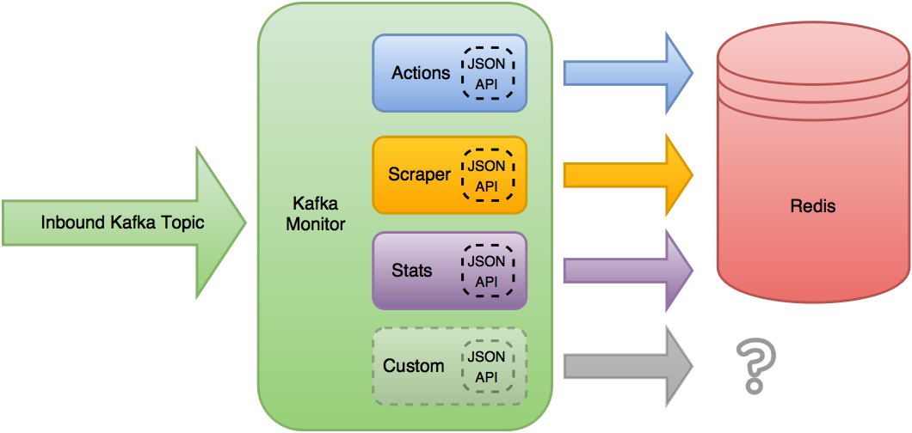

Design
==============

The design of the Kafka Monitor stemmed from the need to define a format that allowed for the creation of crawls in the crawl architecture from any application. If the application could read and write to the kafka cluster then it could write messages to a particular kafka topic to create crawls.

Soon enough those same applications wanted the ability to retrieve information about their crawls, stop them, or get information about their cluster. We decided to make a dynamic interface that could support all of the request needs, but utilize the same base code. This base code is now known as the Kafka Monitor, which utilizes various Plugins to extend or alter the Kafka Monitor's functionality.

The Kafka Monitor reads from the desired inbound Kafka topic, and applies the currently loaded Plugin's JSON APIs to the received message. The first Plugin to have a valid `JSON Schema <http://json-schema.org/latest/json-schema-core.html>`_ for the received JSON object is then allowed to do its own processing and manipulation of the object.

In Scrapy Cluster's use case, the default Plugins write their requests into Redis keys, but the functionality does not stop there. The Kafka Monitor settings can alter which plugins are loaded, or add new plugins to extend functionality. These modules allow the Kafka Monitor core to have a small footprint but allow extension or different plugins to be run.

The Kafka Monitor can be run as a single process, or part of the same Kafka consumer group spread across multiple machines and processes. This allows distributed and fault tolerant throughput to ensure the crawl requests to the cluster are always read.

From our own internal debugging and ensuring other applications were working properly, a utility program called Kafka Dump was also created in order to be able to interact and monitor the kafka messages coming through. This is a small dump utility with no external dependencies, to allow users to get an insight into what is being passed through the Kafka topics within the cluster.

From our own internal debugging and ensuring other applications were working properly, a utility program called Kafka Dump was also created in order to be able to interact and monitor the kafka messages coming through. This is a small dump utility with no external dependencies, to allow users to get an insight into what is being passed through the Kafka topics within the cluster.

