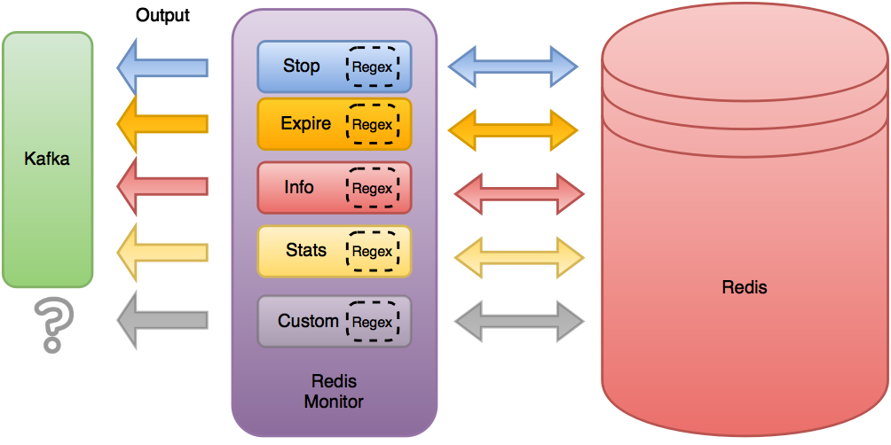

Design
==============

The Redis Monitor is designed to act as a surgical instrument which allows an application to peer into the queues and keys managed by Redis that are used by Scrapy Cluster. It runs independently of the cluster, and interacts with the items within Redis through the use of Plugins.

Every Plugin used by the Redis Monitor looks for a specific set of keys within Redis, which is determined by a `regular expression <http://redis.io/commands/KEYS>`_. When a key is found within that matches the expression, both the key and the value are transferred to the Plugin for further processing.

For Scrapy Cluster, the default plugins take their results and either do data manipulation further within Redis, or send a Kafka message back out to the requesting application. The Redis Monitor's settings allow for full customization of the kinds of plugins you wish to run, and in the order they are processed.

This allows the core Redis Monitor code to remain small, but allows for customization and extendability. That, in combination with the ability to run multiple Redis Monitors across a number of different machines, provides fault tolerance and the ability to interact with the cluster in many different simultaneous ways.

