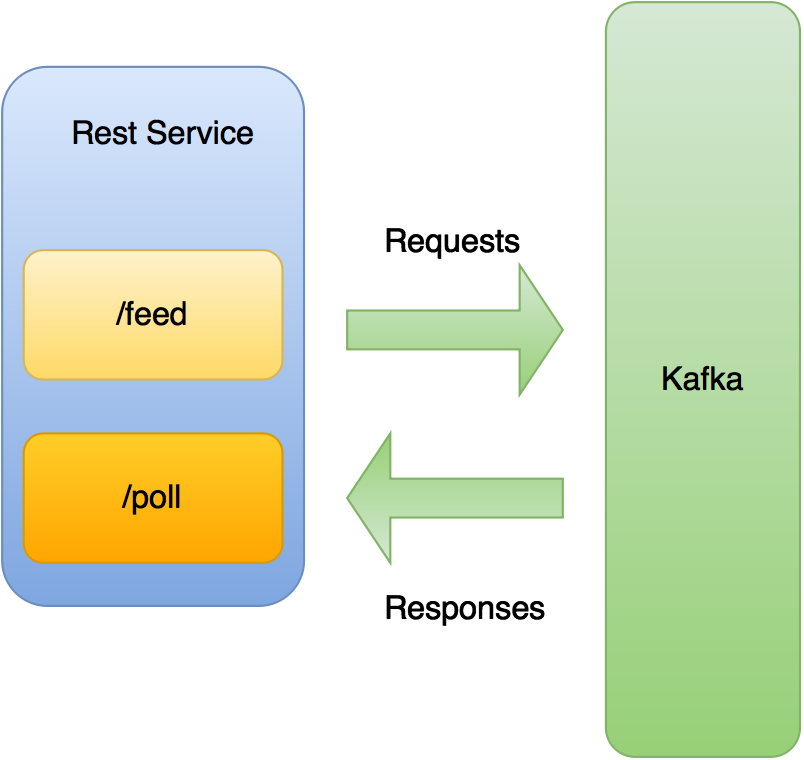

Design
======

The Rest service is designed to act as a gateway into your Scrapy Cluster in order to provide services for requests and information that otherwise may not speak to Kafka. It provides a pass-through style interface, allowing the :doc:`../kafka-monitor/index` to handle the actual validation of the request.

The Rest service is one of the newer components to Scrapy Cluster, and provides the ability for a service to provide arbitrary JSON to be passed to the cluster, and to request information for longer jobs that traditionally time out during the execution of a call.

The ability for Scrapy Cluster to provide restful interaction opens up the door to User Interfaces, http/https requests, and generally more usability of the system. Built upon a simple `Flask <http://flask.org>`_ framework, the Rest service provides a foundation for Restful Kafka interaction and with Scrapy Cluster.
